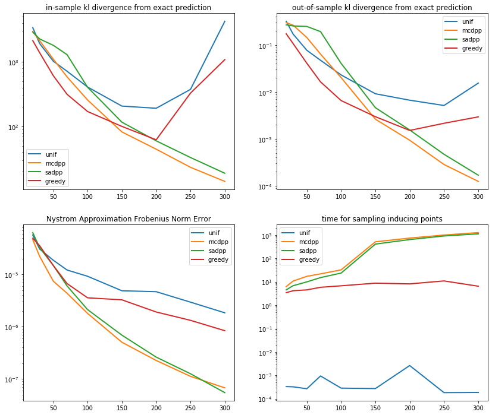

# Determinantal Point Process

This repository includes the source code for Gaussian process regression combined with the Nystrom approxomation by k-DPP sampling. The results of the numerical experiments can be checked in the "./demo.ipynb".

## Prerequisites
* `Python 3.7`
* `numpy`
* `scipy`
* `matplotlib`
* `multiprocessing`
* `time`

---

## Demo on Gaussian Process with Nystrom Method

For the landmark selection of the Nystrom method, we used 4 methods;
* uniform sampling
* k-DPP (by Gibbs sampling)
* simmulated annealing of the MAP of k-DPP
* greedy algorithm for the likelihood maximization

